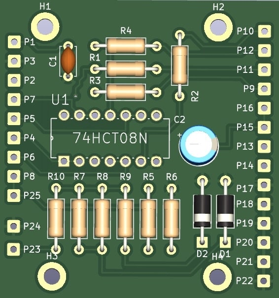

# Atari 2600 Mod SECAM

This project is documentation and gerber files (files to create PCBs) to get SCART SECAM RGB Video Output of your Atari 2600.

No more blury, awful soup of pixels. Welcome clean big early 80's pixel.

## Disclaimer

All credits remains for Mr Eddy works which you can find here : http://eddystoys.blogspot.com/2014/08/atari-2600.html

If you want a ready to use kit you can buy it here :

- PCB Only : https://klydes-korner.site/en/product/convertisseur-video-rgb-atari-2600-secam-pcb-seul/
- Kit to solder : https://klydes-korner.site/en/product/convertisseur-video-rgb-atari-2600-secam-kit/
- Ready To Use : https://klydes-korner.site/en/product/convertisseur-video-rgb-atari-2600-secam/

You also have  CMS version of the PCB from the Modder Brothers : https://gitlab.com/modderbrothers/a2600-secam-rgb

## Before and After

### Before

### After

## Warning

It need soldering on your Atari 2600, I would say it's medium skill soldering, it's not so difficult.

Be aware you can damage your Atari 2600 and it's your responsability.

## How to build

### PCB

Go to PCBWay, Fast PCB, JL PCB or other supplier using this zip file : [gerber/AtariSecam.zip](gerber/AtariSecam.zip).

If your lazy your use my PCBWay project and make your order from here : (to be filled).

## Components

| Reference | Value | Qté |
|---|---|---|
| C1 | 100nF | 1 |
| C2 | 47uF | 1 |
| D1 | D_Zener 2.7v | 1 |
| D2 | D_Zener 10v | 1 |
| R1-R4 | 470R | 4 |
| R5, R10 | 1K | 2 |
| R6 | 1k | 1 |
| R7, R8 | 300R | 2 |
| R9 | 200R | 1 |
| U1 | 74HCT08N | 1 |

You also need :
- a scart cable from garage sales or "Foire à tout" like we say in Normandy.
- wiring cable.

## Wiring

### SCART

| PCB | SCART |
|---|---|
| P9 | SCART R (15) |
| P10 | SCART G (11) |
| P11 | SCART B (7) |
| P12 | SCART Synchro (20) |
| P13 | SCART Com Slow (8) |
| P14 | SCART Com Fast (16) |
| P15 | SCART Audio R (2) |
| P16 | SCART Audio L (6) |
| P17 | SCART Ground R (13) |
| P18 | SCART Ground G (9) |
| P19 | SCART Ground B (5) |
| P20 | SCART Ground Sync (17) |
| P21 | SCART Ground Audio (4) |
| P22 | SCART Shield (21) |

If you get a male/male scart cable that you cut of beware that the wiring between audio (2,4 - 1,5) and synchro (20-19) is inverted (input to output), always check this is the right pin on the scart you will plug. I lost 2 hours to diagnose and rewire.

### Atari 2600

| Mod PCB | Comments | Atari 2600 PCB |
|---|---|---|
| P1 | +5v | Power regulator Right one - green wire on the photo |
| P2 | +9,5v | Power regulator left one - red wire on the photo |
| P3 | Ground | Power regulator middle one - black wire on the photo |
| P4 | TIA LUM 0 | C0111903/UM6521* (Pal) : 7     C01014444D (NTSC) : 2 |
| P5 | TIA LUM 1 | C0111903/UM6521* (Pal) : 5    C01014444D (NTSC) : 8 |
| P6 | TIA LUM 2 | C0111903/UM6521* (Pal) : 6    C01014444D (NTSC) : 5 |
| P7 | TIA Synchro | C0111903/UM6521* (Pal) : 2    C01014444D (NTSC) : 7 |
| P8 | TIA Audio | C0111903/UM6521* (Pal) : 13     C01014444D (NTSC) : 13 |
| P25 | Iso potential P8 | Not connected |

_Wiring for P1, P2, P3, All credits to Mr Eddy_

To identify better the wiring on the Atari 2600 : 

_All credits to Mr Eddy_

Note that the C011903 can have other name, on mine it was an UM6521P1, it exactly the same wiring as the C011903.

On the table, the C01014444D it's the same chip but for NTSC Atari 2600. 

### LED - Optional

Optional, you can plug a 10mA or 20mA LED on P23 and P24.

P23 is + wiring (long pin).

P24 is ground wiring (short pin).

## Video Tutorials

(French) CabriDIY / [Atari 2600] Construction du kit RGB pour Atari 2600 https://youtu.be/S6Wm6l0JoSQ?si=zYLoU-hGtrezSI1l

(French) CabriDIY / [Atari 2600] Installation d'un mod RGB sur une Atari 2600 (prise péritel) https://youtu.be/MnF89gb17LY?si=qCZCWdnxvj2ZiaQF